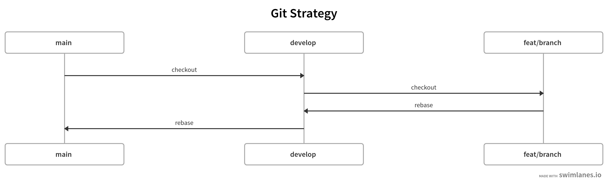

<!-- TABLE OF CONTENTS -->
<details>
  <summary>Table of Contents</summary>
  <ol>
    <li>
      <a href="#about-the-project">About The Project</a>
      <ul>
        <li><a href="#built-with">Built With</a></li>
      </ul>
    </li>
    <li>
      <a href="#getting-started">Getting Started</a>
      <ul>
        <li><a href="#prerequisites">Prerequisites</a></li>
        <li><a href="#installation">Installation</a></li>
      </ul>
    </li>
    <li><a href="#usage">Usage</a></li>
    <li><a href="#folder-structure">Folder Structure</a></li>
    <li><a href="#git-strategy">Git Strategy</a></li>
    <li><a href="#dev-links">Dev Links</a></li>
  </ol>
</details>


<!-- ABOUT THE PROJECT -->
## About The Project


Custom built range input component.

<p align="right">(<a href="#readme-top">back to top</a>)</p>


### Built With

Below are the core technologies I used for this project.

* [Next.js](https://nextjs.org/)
* [React](https://reactjs.org/)
* [Typescript](https://www.typescriptlang.org/)
* [Sass](https://sass-lang.com/)
* [Vercel](https://vercel.com/)
* [Github](https://github.com/)
* [eslint](https://eslint.org/)
* [prettier](https://prettier.io/)
* [husky](https://github.com/typicode/husky)


<p align="right">(<a href="#readme-top">back to top</a>)</p>

<!-- GETTING STARTED -->
## Getting Started

To run this project, please follow the steps below.

### Prerequisites

To install node 20.7.0, run the command below.

* node
  ```sh
  nvm install v20.7.0
  ```

To install yarn run the command below.
* yarn
  ```sh
  npm install --global yarn
  ```

### Installation

1. Clone the repo
   ```sh
   git@github.com:zafar-saleem/range-input.git
   ```
2. Install NPM packages
   ```sh
   yarn
   ```

<p align="right">(<a href="#readme-top">back to top</a>)</p>

<!-- USAGE EXAMPLES -->
## Usage

To run the project, below command will help.

  ```sh
  yarn dev
  ```

<p align="right">(<a href="#readme-top">back to top</a>)</p>


<!-- FOLDER STRUCTURE -->
## Folder Structure

  ```bash
  .
  ├── README.md
  ├── app
  │   ├── favicon.ico
  │   ├── global.scss
  │   ├── layout.tsx
  │   └── page.tsx
  ├── commitlint.config.js
  ├── components
  │   └── RangeInput
  │       ├── RangeInput.tsx
  │       ├── RangeInputContainer.tsx
  │       ├── RangeInputInterfaces.tsx
  │       ├── RangeInputStyles.scss
  │       └── index.tsx
  ├── next-env.d.ts
  ├── next.config.js
  ├── package.json
  ├── public
  │   ├── next.svg
  │   └── vercel.svg
  ├── screenshot
  │   ├── git-strategy.png
  │   └── screenshot.png
  ├── tsconfig.json
  └── yarn.lock
  ```

<p align="right">(<a href="#readme-top">back to top</a>)</p>

<!-- GIT STRATEGY -->
## Git Strategy

Below is the complete git workflow.



<p align="right">(<a href="#readme-top">back to top</a>)</p>

<!-- DEV LINKS -->
## Dev Links

* [GitHub Project](https://github.com/zafar-saleem/range-input)
* [Commits](https://github.com/zafar-saleem/range-input/commits/main/)
* [CI/CD Pipelines](https://github.com/zafar-saleem/range-input/deployments)
* [Branches](https://github.com/zafar-saleem/range-input/branches)
* [Live Demo](https://range-input-omega.vercel.app/)
